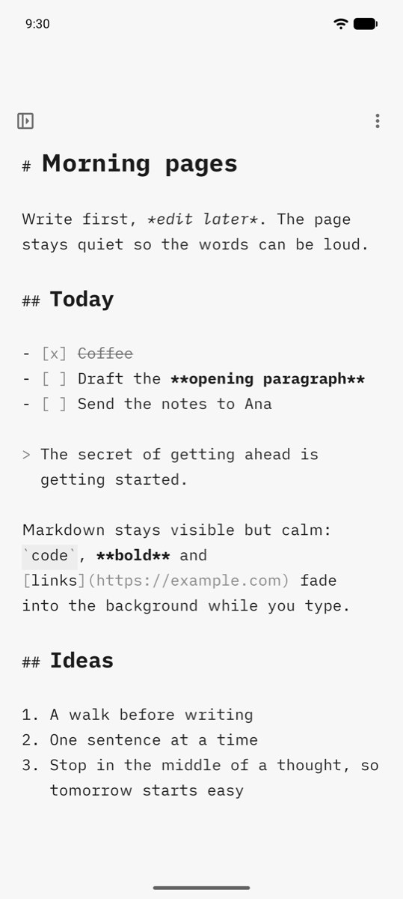
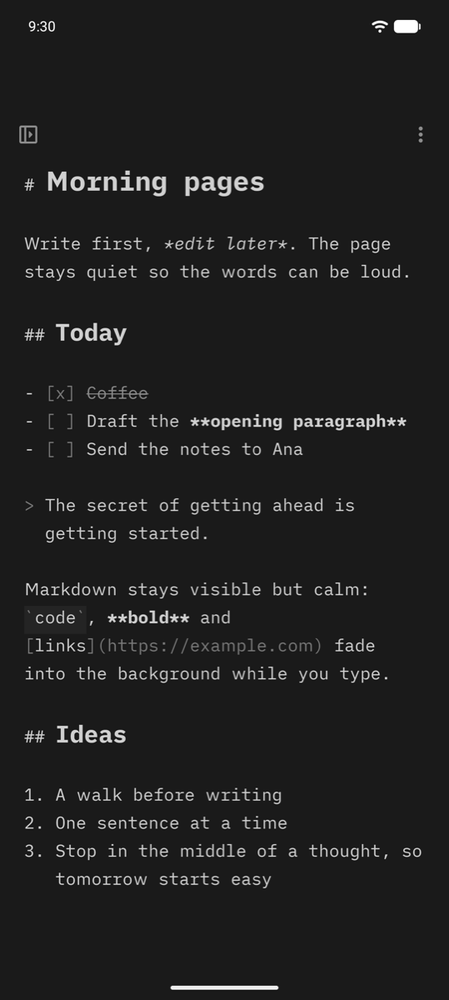
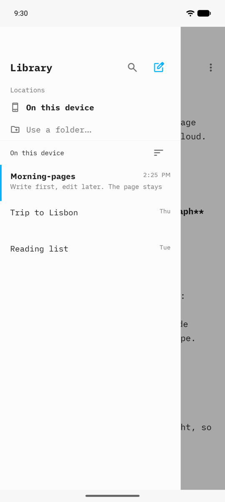
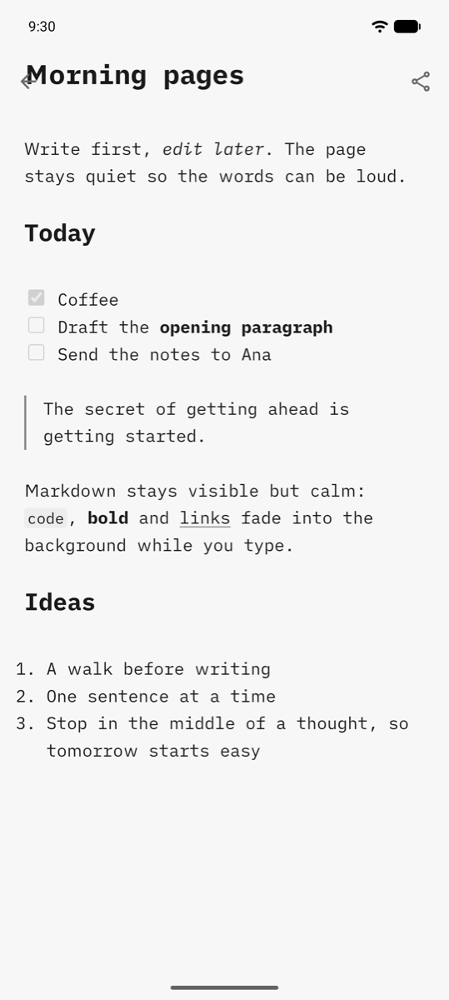
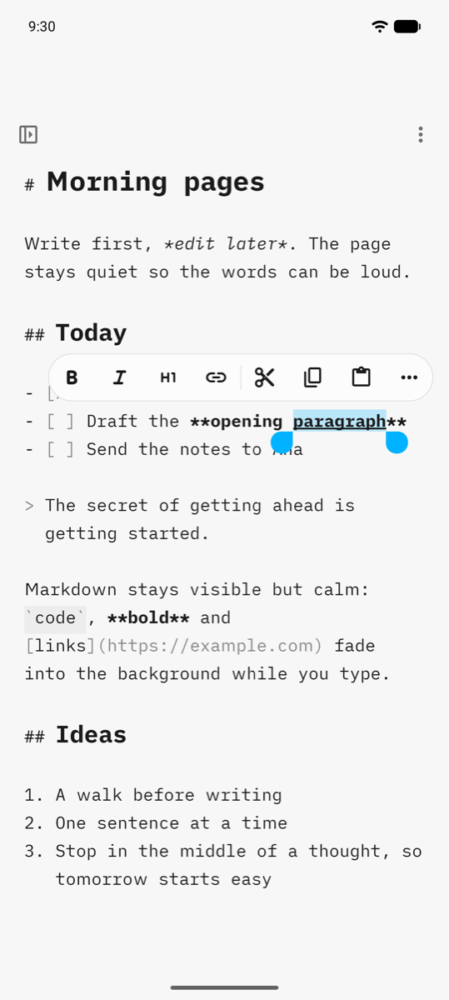
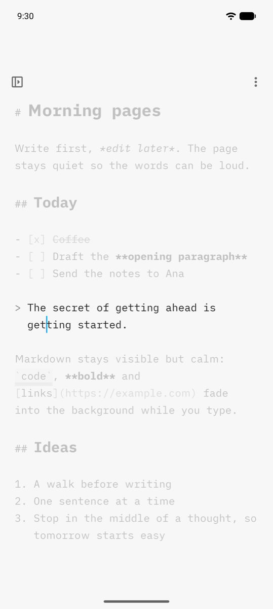
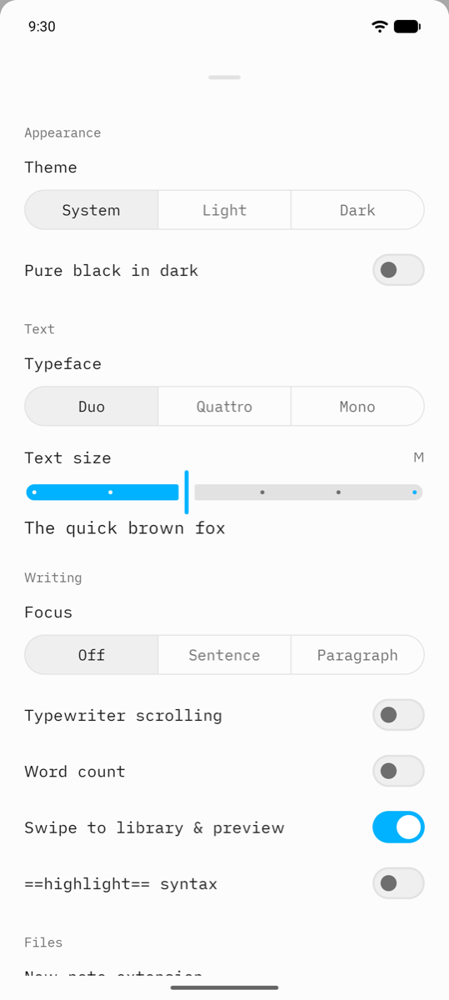
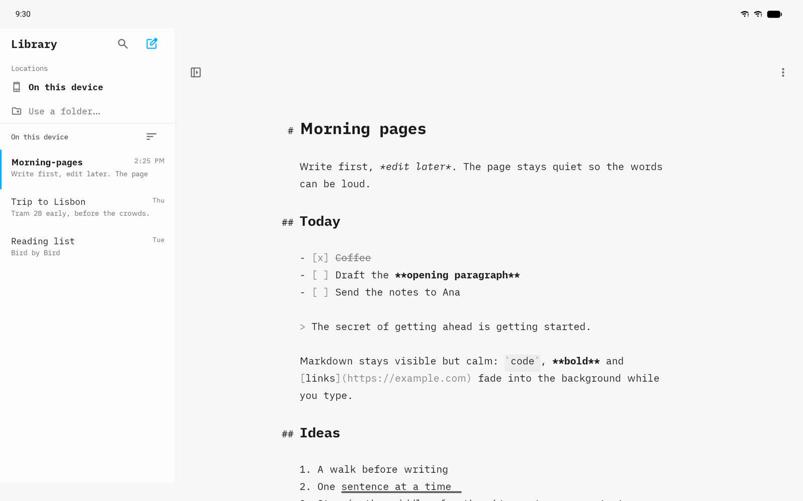

# mdwriter

**A quiet, private Markdown editor for Android.** Open it and write. No accounts, no cloud, no ads, no
network access at all: your notes never leave your phone unless you share them.

<p align="center">
  
  &nbsp;
  
</p>

## Why this exists

For years the best plain-text writing app on Android was [iA Writer](https://ia.net/writer). In September 2024
Information Architects [stopped developing the Android version](https://ia.net/topics/our-android-app-is-frozen-in-carbonite)
after Google cut its Google Drive access and demanded yearly paid security audits, and the app
[was removed from sale](https://ia.net/writer/support/help/writer-classic/ia-writer-legacy-for-android). Existing copies
are unsupported and "may become less reliable with newer Android versions". (Press coverage:
[Thurrott](https://www.thurrott.com/mobile/android/310882/ia-writer-abandons-android-citing-google-play-policy-changes).)

**That is the only reason mdwriter exists.** I wanted that same calm writing experience on a current Android phone,
so I built a small app in its spirit: plain `.md` files, a typeface made for writing, Markdown you can see but that
stays out of the way, and nothing else. If iA Writer ever comes back to Android, use it and support them.

mdwriter is an independent personal project. It is **not affiliated with, endorsed by, or connected to Information
Architects Inc.** "iA Writer" is their trademark. mdwriter uses their open-source iA Writer Duo, Quattro and Mono
fonts under the SIL Open Font License (see [Credits](#credits)).

## What it does

| | | |
|:---:|:---:|:---:|
|  |  |  |
| **Library.** Swipe right for all your notes. Search, folders, and folders anywhere on your phone. | **Preview.** Swipe left for a clean rendered page, fully offline. | **Formatting pill.** Select text for bold, italic, headings, links and more. |
|  |  | |
| **Focus mode.** Everything but the current sentence or paragraph fades away. | **Settings.** Theme, typeface, text size, and a few writing options. That is all. | |

On a tablet or a wide window, the library stays open beside the text, and heading marks hang in the margin:

<p align="center">
  
</p>

- **Markdown styled as you type.** Headings grow, bold gets bold, links and markers turn grey. The text stays plain
  Markdown you can open anywhere.
- **No Save button.** Notes save themselves while you write and reopen exactly where you left off.
- **Typewriter scrolling** keeps the line you are writing in the middle of the screen. **Word count** is optional.
- **Find and replace**, **task lists** you can tick with a tap, and **undo/redo**.
- **Your files, your folders.** Keep notes inside the app, or link any folder on the phone (for example
  `Documents/Notes`) and edit the files right there.
- **Share** a note, **open** `.md` and `.txt` files from other apps, and **export all notes** as a zip.
- Light, dark and pure-black themes, three typefaces (Duo, Quattro, Mono) and six text sizes.

## Your notes stay yours

- **No permissions.** The app asks for nothing: no internet, no storage, no contacts.
- **No network.** It cannot connect anywhere; the preview is rendered on the phone.
- **No accounts, no analytics, no crash reporting.**
- **Where notes live:**
  - Notes in the app's own library are private to the app and are **deleted if you uninstall it**. Android's own
    backup may copy them (Google backup only when your backup is encrypted, and phone-to-phone transfer).
  - Notes in a linked folder stay in that folder, like any other file.
- **Getting your notes out:** Settings > **Export all notes…** saves every note as a `.zip` wherever you choose.

## Using mdwriter

**Gestures**
- Swipe **right** across the text: open the library. Swipe **left**: open the preview. (You can turn swipes off in
  Settings.)
- Select text to get the formatting pill.
- Tap a task box `- [ ]` to tick it.
- The two small buttons in the corners fade out while you type; tap near the top to bring them back.
- **Back** closes, in order: the keyboard, the selection, the find bar, the library, the preview.

**Keyboard shortcuts** (with a hardware keyboard; press **Meta+/** in the app to see them all)

| Shortcut | Action | Shortcut | Action |
|---|---|---|---|
| Ctrl+N | New note | Ctrl+B / Ctrl+I | Bold / Italic |
| Ctrl+L | Show/hide the library | Ctrl+K | Link |
| Ctrl+R | Preview | Ctrl+Shift+C | Code |
| Ctrl+F | Find | Ctrl+Shift+X | Strikethrough |
| Ctrl+Z / Ctrl+Shift+Z | Undo / Redo | Ctrl+1 … Ctrl+6, Ctrl+0 | Heading 1-6, body text |

## Install on your phone

mdwriter is not on the Play Store. You build it on a Mac and install it on your phone with one command.
It runs on **Android 16 or 17**.

### 1. One-time setup on the Mac
- Install **Android Studio** (it brings the Android SDK, `adb` and a Java runtime). Nothing else is
  needed; you do not have to put `adb` on your PATH.
- Check everything: `make doctor`

### 2. One-time setup on the phone
1. **Enable Developer options:** Settings > About phone > tap **Build number** 7 times, enter your
   PIN ("You are now a developer!").
2. Open **Settings > System > Developer options**.

Then pick **one** way to connect:

**USB cable (simplest)**
1. In Developer options, turn on **USB debugging**.
2. Plug the phone into the Mac. On the phone, accept **Allow USB debugging?**; tick
   **Always allow from this computer**.

**Wi-Fi (no cable; phone and Mac on the same Wi-Fi network)**
1. In Developer options, tap **Wireless debugging**, turn it on, and allow it on this network.
2. Tap **Pair device with pairing code**. The phone shows a 6-digit code and an
   *IP address & port*.
3. On the Mac: `make pair HOST=192.168.1.23:37123 CODE=123456` (use the values from the phone).
4. The phone normally connects by itself a few seconds later (`make devices` shows it). If it
   does not: `make connect HOST=<IP address & port shown on the main Wireless debugging screen>`
   (this port is different from the pairing port).
   Pairing is remembered; next time just turn Wireless debugging on.

### 3. Install
```sh
make install        # builds, installs (or updates) and opens mdwriter; your notes are kept
```
Several phones or an emulator connected? `make install DEVICE=<serial>` (see `make devices`).
You can turn Developer options off again afterwards; the app keeps working.

### 4. Back up your signing key (important)
The first `make install` creates `~/.config/mdwriter/release.jks` and
`~/.config/mdwriter/keystore.properties`. **Every future update must be signed with this key.**
Copy the whole `~/.config/mdwriter/` folder to your password manager or an encrypted backup
(`make keystore-info` shows where the files are and their fingerprint). On a new Mac, put them back
*before* running `make install`. Without the key you cannot update the app without uninstalling it,
and uninstalling deletes the notes stored inside the app.

### Updating
`git pull && make install`. Your notes are kept: every build has a higher version number, so it is an
in-place update. Never uninstall the app to "reinstall" it.

### Troubleshooting
| Message | Meaning / fix |
|---|---|
| `no Android device connected` | USB: cable/port, USB debugging on, accept the prompt. Wi-Fi: Wireless debugging on, same network, `make pair` again. |
| device `unauthorized` | Unlock the phone and accept **Allow USB debugging?**. No prompt? Developer options > **Revoke USB debugging authorizations**, unplug, replug. |
| `2 devices connected - choose one` | `make install DEVICE=<serial>` (serials from `make devices`). |
| `needs Android 16 (API 36) or newer` / `INSTALL_FAILED_OLDER_SDK` | The phone runs Android 15 or older; mdwriter supports Android 16 and 17 only. |
| `INSTALL_FAILED_UPDATE_INCOMPATIBLE` (signed with a DIFFERENT key) | The app on the phone was signed with another key (new Mac, lost `~/.config/mdwriter`). **Nothing was changed on the phone.** Restore your backed-up key files and run `make install` again. Only if the key is truly lost: export your notes first, then `make uninstall CONFIRM=yes && make install` (uninstalling deletes the notes inside the app). |
| `INSTALL_FAILED_VERSION_DOWNGRADE` | The phone has a newer build (Mac clock wrong?). `make install VERSION_CODE=<bigger number>`. |
| `INSTALL_FAILED_USER_RESTRICTED` | Accept the prompt on the phone; on Xiaomi/Oppo/Vivo also enable Developer options > **Install via USB**. |
| Samsung: USB commands ignored | Settings > Security and privacy > **Auto Blocker** blocks USB commands; turn it off while installing. |
| `offline` device | Unplug/replug, or restart adb: `~/Library/Android/sdk/platform-tools/adb kill-server`. |
| `no JDK 17-26 found` | Install Android Studio, or `brew install openjdk@21`. Gradle cannot run on Java 27. |
| Something else breaks | Run `make logcat` while reproducing it and keep the output; `make doctor` checks the Mac side. |

## Known limitations

- Very long notes (hundreds of pages) are slower: typing in a 100,000-character note is noticeably less snappy, and
  opening a 300,000-character note takes a few seconds.
- Right-to-left text (Arabic, Hebrew) works, but on wide screens those paragraphs are offset by the heading margin.
- Notes over 5 MB open read-only; files over 16 MB and non-text files are refused.
- It has been tested on the Android emulator. Some things (TalkBack, very large font sizes, split screen,
  right-to-left layouts, three-button navigation) have not yet been checked on a real phone.

## Credits

- Fonts: **iA Writer Duo, Quattro and Mono** by Information Architects Inc., based on IBM Plex, under the
  SIL Open Font License 1.1. The full licence texts are in `app/src/main/assets/licenses/` and in the app under
  Settings > About.
- Markdown parsing for the preview: [commonmark-java](https://github.com/commonmark/commonmark-java) and
  [autolink-java](https://github.com/robinst/autolink-java).

## For developers

| Command | What it does |
|---|---|
| `make help` | List all targets. |
| `make doctor` | Check JDK, SDK, signing key and connected devices. |
| `make emulator` | Boot the default AVD (`Pixel_10_Pro_XL`) and wait until ready. |
| `make devices` | List connected devices with their Android version. |
| `make install-debug DEVICE=<serial>` | Build + install + launch the debug app (`me.gcg.mdwriter.debug`, a separate app with its own notes). |
| `make run` / `make run-debug` | Launch the installed release / debug app (no build). |
| `make test` | Run all JVM unit tests. |
| `make test-device DEVICE=<serial>` | Run instrumented tests on a device or emulator. |
| `make lint` / `make format` | Android Lint / auto-format (Spotless + ktlint). |
| `make check` | What CI runs: format check, lint, unit tests, release build (R8). |
| `make logcat` | Stream the app's logs (release + debug). |
| `make keystore-info` | Show where the release signing key is and its fingerprint. |
| `make backup-notes` | Copy the **debug** app's notes to `./notes-backup-<time>/` (the release app's notes can't be read over adb; use Export). |
| `make uninstall CONFIRM=yes` | Uninstall the release app. **Deletes every note stored inside it.** |

Requirements: Android Studio (brings the SDK + a JDK). For raw Gradle calls:
`export JAVA_HOME=$(/usr/libexec/java_home -v 21)` (Gradle 9 cannot run on JDK 27).

Project layout: `app/` is the Android app (Compose UI, a View-based editor engine, storage, settings);
`core/markdown/` is a pure Kotlin Markdown engine; `plans/` holds the implementation plan, QA matrix and
performance results; `docs/screenshots/` holds the images above (taken on the Android emulator).
